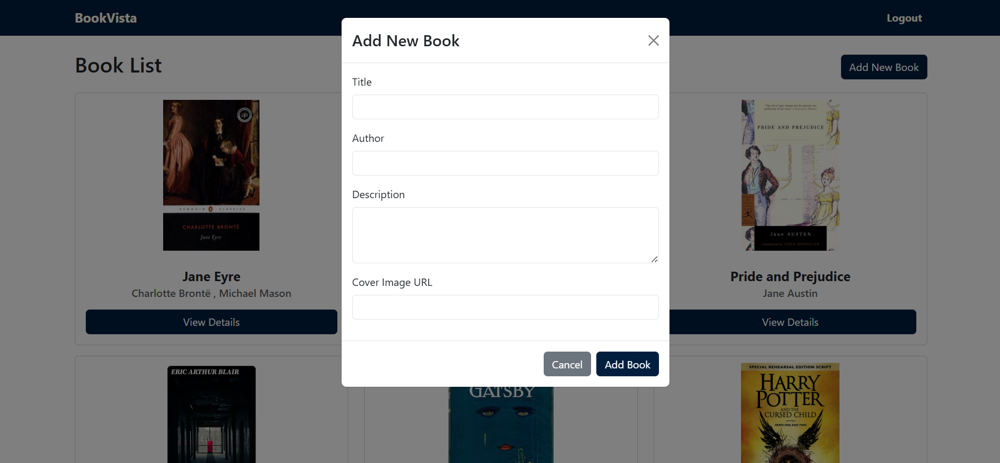

# BookVista - A Book Review Board

**BookVista** is a full-stack MERN (MongoDB, Express.js, React.js, Node.js) web application where users can add books they've read, view details and ratings of all listed books, and share their own reviews.
It allows readers to explore other's contributions, gain insights into different books, and understand varied opinions.
It implements authentication, CRUD operations, protected API routes, and a responsive design for seamless use across devices.

---

## Setup Instructions

### 1. Frontend Setup

git clone https://github.com/meera37/bookreview_board_frontend.git

- cd frontend
- npm install
- npm run dev

### 2. Backend Setup 

git clone https://github.com/meera37/bookreview_board_backend.git

- cd backend
- npm install
- node index.js

Create a .env file in backend folder.
- DATABASE= your mongodb connectionstring
- SECRETKEY= your secret key

### 3. MongoDB Setup
- Ensure you have MongoDB running locally or use MongoDB Atlas.
- Update your .env file in the backend folder with the database connection string.

---

## API Routes

### Auth
- **POST** `/register` – Register a new user.
- **POST** `/login` – Login user and return JWT.

### Books
- **POST** `/books` – Add a new book (Auth required).
- **GET** `/books` – Get all books (Public).
- **GET** `/books/:id` – Get single book by ID (Public).

### Reviews
- **POST** `/books/:id/reviews` – Add a review to a book (Auth required).
- **PUT** `/books/:bookId/reviews/:reviewId` – Update a review (Auth required).

---

## Technologies Used

### Frontend:
- React.js
- React Router DOM
- Axios
- Bootstrap / React-Bootstrap
- React Toastify
- Font Awesome Icons

### Backend:
- Node.js + Express.js
- MongoDB + mongoose
- JWT (JSON Web Token) Authentication
- bcryptjs for password hashing
- dotenv for environment variables
- CORS middleware

## Screenshots

